# Lambda-Function-API-endpoint

**Build a simple serverless file upload system**

**What You'll Build (Using AWS Console):**

1. S3 Bucket: For file uploads

2. Lambda 1 (S3 Trigger): Stores metadata in DynamoDB

3. DynamoDB Table: Stores file name + timestamp

4. Lambda 2 (API Gateway): Fetches metadata

5. API Gateway: REST endpoint connected to Lambda 2

**1. Create an S3 Bucket**

i. Go to S3 > Create bucket

ii. Enter a globally unique name, e.g. file-upload-s3test-bucket

iii. Uncheck “Block all public access” if needed (for testing only)

iv. Create the bucket

**2. Create DynamoDB Table**

i. Go to DynamoDB > Tables > Create table

ii. Table name: fileMetadata

iii. Partition key: filename (type: String)

iv. Click Create Table

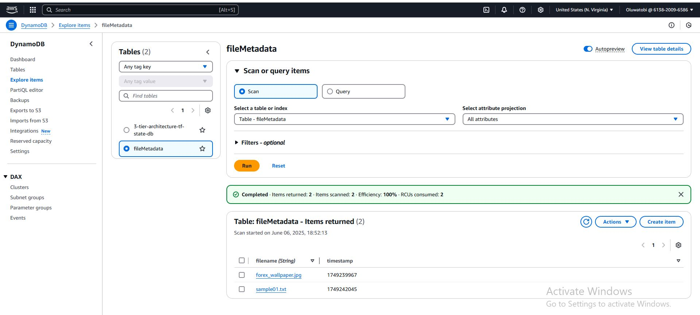

**3. Create IAM Role for Lambda**

i. Go to IAM > Roles > Create Role

ii. Trusted entity: AWS service → Lambda

iii. Permissions: Attach the following:

     AWSLambdaBasicExecutionRole

     AmazonDynamoDBFullAccess

     AmazonS3FullAccess

iv. Name it: LambdaS3DynamoRole

v. Create Role

**4. Create Lambda 1 (S3 Trigger)**

i. Go to Lambda > Create Function

ii. Name: S3TriggerLambda

iii. Runtime: Python 3.11

iv. Role: Use existing → LambdaS3DynamoRole

v. Click Create function

Your Code sesseion, import code (lambda_s3_trigger.py):

import boto3
import time

dynamodb = boto3.resource('dynamodb')
table = dynamodb.Table('FileMetadata')

def lambda_handler(event, context):
    for record in event['Records']:
        key = record['s3']['object']['key']
        timestamp = int(time.time())
        table.put_item(Item={'filename': key, 'timestamp': timestamp})
    return {'statusCode': 200, 'body': 'Metadata stored'}

vi. Deploy your code.

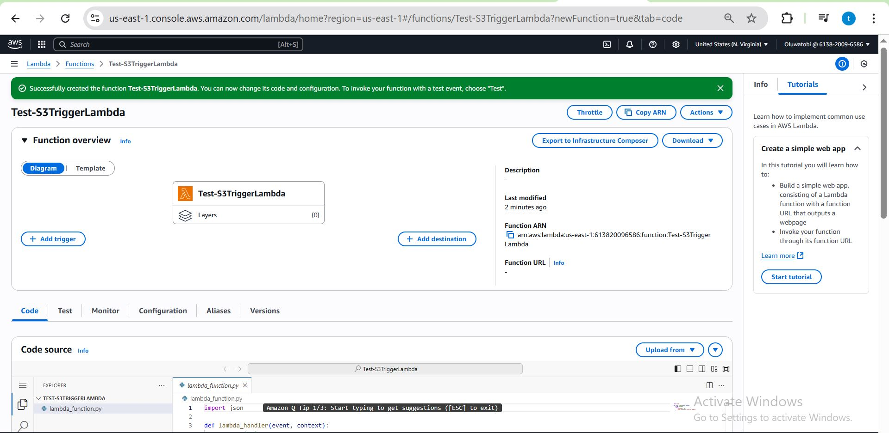

**5. Add S3 Trigger to Lambda**

i. In S3TriggerLambda, scroll to Triggers

ii. Add Trigger → S3

iii. Bucket: file-upload-tobi-bucket

iv. Event type: PUT (ObjectCreated)

v. Check "Enable trigger"

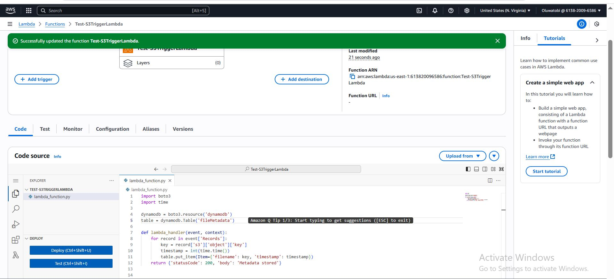

 **6. Simulate the Event in Lambda Test**
 
i. In Lambda console → S3TriggerLambda

ii. Go to Test → Configure test event

iii. Create a Test Event using this JSON code:

{
  "Records": [
    {
      "eventName": "ObjectCreated:Put",
      "s3": {
        "bucket": {
          "name": "Bucket Name"
        },
        "object": {
          "key": "example.txt"
        }
      }
    }
  ]
}

iv. Save and run the test 

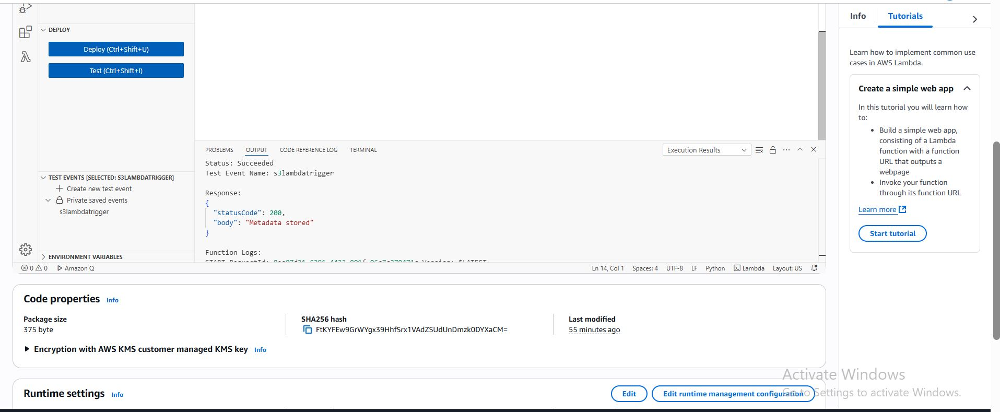

**7. Create Lambda #2 (Fetch Metadata)**

i. Go to Lambda > Create Function

ii. Name: FetchMetadataLambda

iii. Runtime: Python 3.11

iv. Role: Use existing → LambdaS3DynamoRole

v. Your Code sesseion, import code (lambda_fetch_metadata.py):

import json
import boto3
from decimal import Decimal
from botocore.exceptions import ClientError

dynamodb = boto3.resource('dynamodb')
table = dynamodb.Table('fileMetadata') 

#Custom encoder to convert Decimal → float
class DecimalEncoder(json.JSONEncoder):
    def default(self, obj):
        if isinstance(obj, Decimal):
            return float(obj)
        return super(DecimalEncoder, self).default(obj)

def lambda_handler(event, context):
    try:
        params = event.get('queryStringParameters', {})
        filename = params.get('filename') if params else None

        if filename:
            response = table.get_item(Key={'filename': filename})
            item = response.get('Item')
            if item:
                return {
                    'statusCode': 200,
                    'body': json.dumps(item, cls=DecimalEncoder)
                }
            else:
                return {'statusCode': 404, 'body': 'File not found'}
        else:
            response = table.scan()
            items = response.get('Items', [])
            return {
                'statusCode': 200,
                'body': json.dumps(items, cls=DecimalEncoder)
            }

    except ClientError as e:
        return {'statusCode': 500, 'body': f"DynamoDB error: {e.response['Error']['Message']}"}

vi. Click deploy

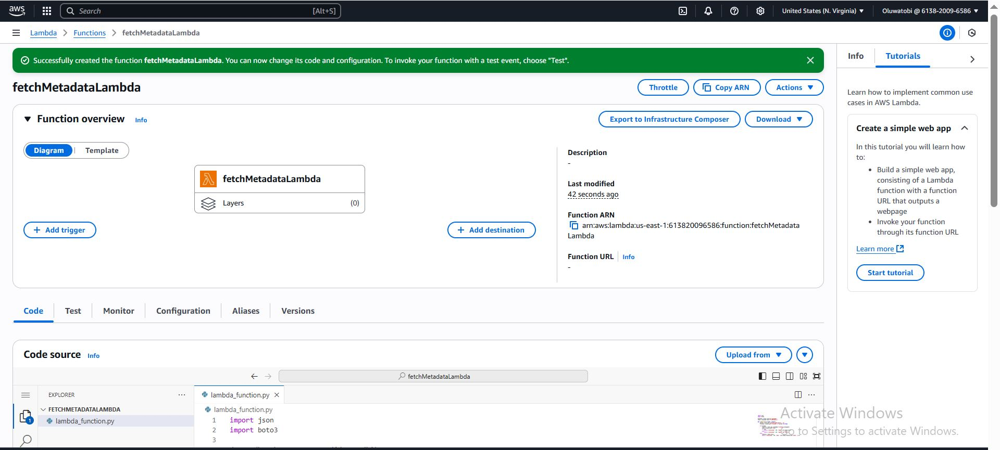

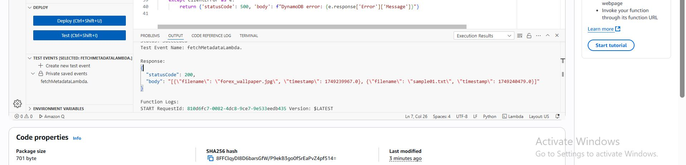

**8. Set Up API Gateway**

i. Go to API Gateway > Create API

ii. Choose REST API

iii. Name: fileMetadataAPI

iv. Create Resource:

   /metadata path

   Method: GET

v. Integration: Choose Lambda function → FetchMetadataLambda

vi. Deploy to a stage: production LambdaS3DynamoRole

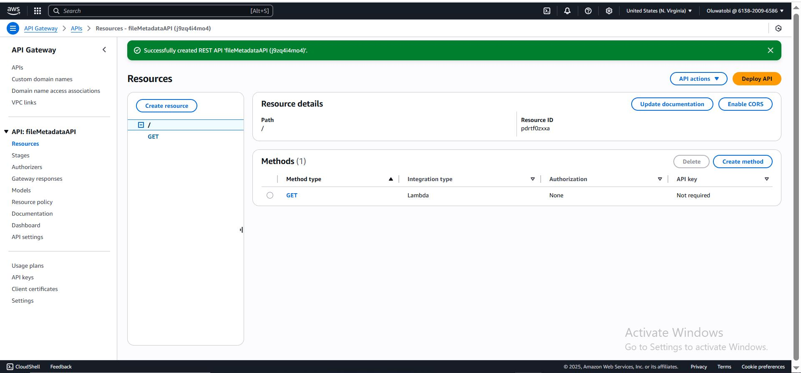

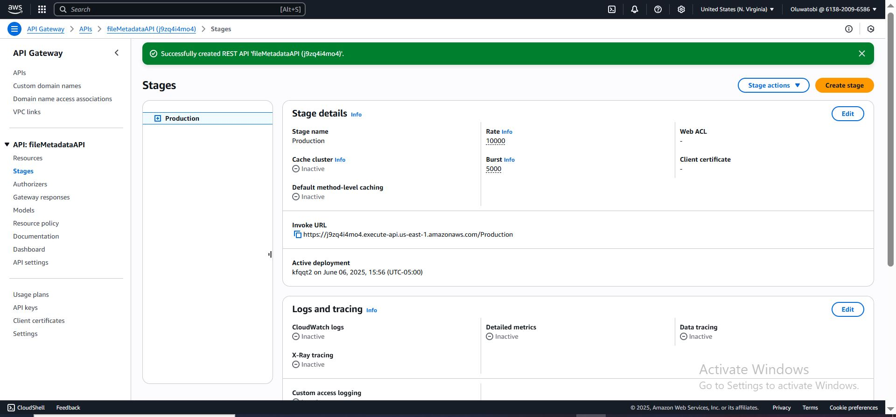

**9. Add Lambda Permission for API Gateway**

i. Go to Lambda > FetchMetadataLambda

ii. Click Configuration > Permissions > Add permissions > Add inline policy

iii. Click on LambdaS3DynamoRole that was created > Add permissions

iv. Add inline policy by importing this code:

{
  "Version": "2012-10-17",
  "Statement": [
    {
      "Effect": "Allow",
      "Action": [
        "dynamodb:PutItem",
        "dynamodb:Scan",
        "dynamodb:GetItem"
      ],
      "Resource": "arn:aws:dynamodb:REGION:ACCOUNT_ID:table/fileMetadata"
    },
    {
      "Effect": "Allow",
      "Action": [
        "s3:GetObject"
      ],
      "Resource": "arn:aws:s3:::your-bucket-name/*"
    }
  ]
}

Replace:
REGION, ACCOUNT_ID, and your-bucket-name with your actual values.

v. Create policy

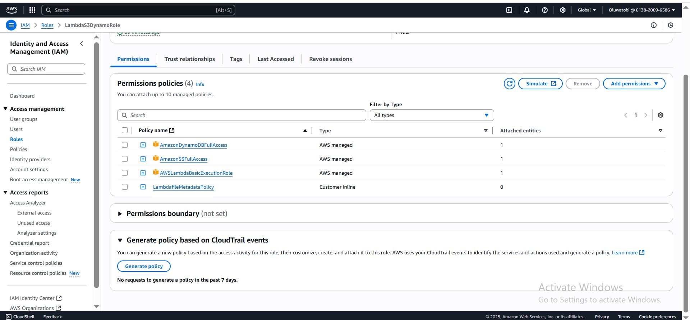

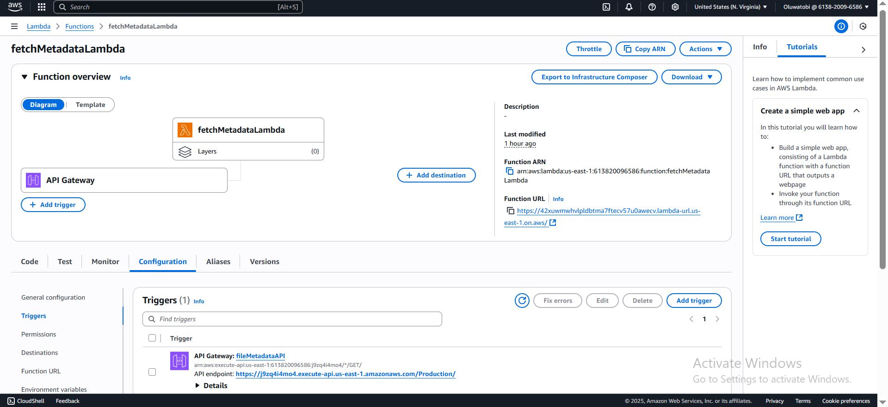

**10. Test Your Setup**

i. Upload a file to S3:

ii. Go to your S3 bucket > Upload a file

iii. Check metadata:
     Go to the API URL and copy the URL to your browser
     
iv. Your fileMetadata should display content Table.

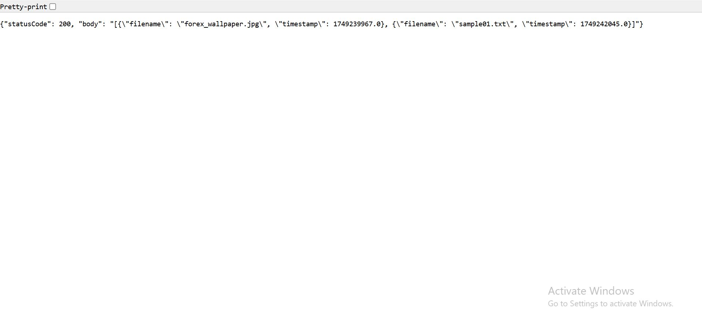
